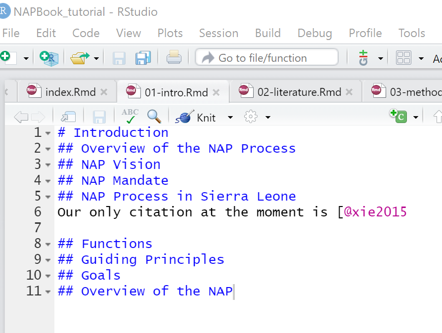
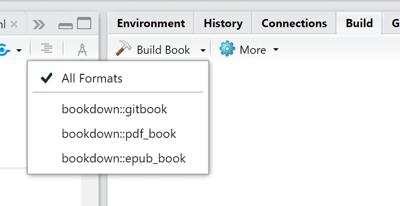

# Bookdown
## Setting up an Open NAP document
We will use the package `bookdown` to generate NAP document in a book format. Journal articles or reports can be produced in the same way. 
We will also use the package `tinytex` to build pdf format of the book document.

1. First, launch the rstudio app in your pc.
2. Install the bookdown and tinytex packages. Use any of the methods shown in the [Installing packages] section.  
3. Then from the menu bar go to `File>->New Project->>New Directory->>Book Project using bookdown`.   
A new window appears   
{width=4in}  

4. Give your bookdown directory a name 'NAPBook_tutorial'. This is the name of a new folder that will be created to store your bookdwon project files.  
5. In the 'Create project as subdirectory of' field, use the browse button to navigate to where you want to save your bookdown project folder.  
6. After you select the directory location, you are returned to the 'Create Book project...' window. Click 'create project'.     
A new project session opens up, with skeleton chapters and other sections and metadata files.     
Your project window might appear with panel arrangements different from mine/in screenshot. 
Your project files can be accessed from the Files tab in bottom right of the project window.
Each chapter is compiled from a single .rmd file, and always starts with a first level header sign '#'.   
From the files pane, you can open any chapter, and edit it to your liking.  
Lets take a look at the '_bookdown.yml' file.  
7. From the 'Files' tab, click on the _bookdown.yml' file.  
The file open up in your script/source pane. Notice, the book_filename takes the name of the folder we created when opening the project.  
8. Let's add the line    `output_dir: "docs"`   to this file. 
See screenshot below;    
   

This command creates an additional folder called 'docs' and specifies that we want to store our outputs here. This folder is necessary for creating webpages from our book project.  
9. Save changes. Use the 'Save' icon on the script window or Ctrl + S on your keyboard.  
10. Next, click to open the '_output.yml' file.  
11. Let's edit the line that contains the title to our book. Change the text 'A Minimal Book ...' to 'NAP Book Tutorial'.  
Should look like this;
  
Ignore everything else for now :)  
12. Save.  
13. Scroll down your files to find the 'index.rmd' file. Click to open.  
14. Edit the title, author & description fields in the yaml header section.  
15. Delete all text, except the last code chunk.   
16. Add a chapter named 'Preliminaries' before the code chunk.   
Chapters are created using the first level header #.   
17. Add sections to your chapter using second level header ##.  
Your script shoud look more or less similar to this; 
   

18. Next, open the 'README.md' file and edit the text to this 'This is an example NAP designed to help you get started with creating your NAPs with bookdown.'. Or add a description of your choice. 
19. Save your work.  
20. Open the '01-Intro.rmd' file.  
21. Type in the chapter title 'Introduction'  
22. Type in sub-chapters with the names 'Overview of the NAP Process, NAP Vision, NAP Mandate, NAP Process in Sierra Leone, Functions, Guiding Principles, Goals, Overview of the NAP'  
Your script should resemble this; 

This text has been borrowed from the Sierra Leone NAP. Use the text from the screenshot below to edit the next two chapters (.rmd files). i.e '02-literature.rmd & 03-methods.rmd'.  


For the interest of time, let's delete chapters 4 and 5 from our project files.  
23. From the files tab (bottom right), click on the check-boxes to the left of the application and summary .rmd files to select them. 
24. Click delete  


25. Save project.  
26. From the 'Environment' window, click on the tab 'Build'.  
27. On the new window that opens, click the hammer/Build Book button to start rendering the book.     
This process may take a few minutes.  You can monitor the progress in the Environment window.    
When the process is done, your book should open up in an html window as below;  

  

28. Scroll down your chapters to find the 'References' chapter. Oops! No reference! Don't sweat.   
29. Back to our project, from the Files tab in bottom right window, open the file named 'book.bib'. This is the text file holding our citations.Currently, only one. You will notice that the document type is a book, and the the book name is 'xie2015'.   


30. To cite this book in our NAP book, open square brackets and type the '@' sign followed by the book name. i.e [@xie2015].   
31. Let's use this citation say in the Introduction chapter. Open the chapter, and insert the text 'Our only citation at the moment is [@xie2015]'.  See example:   



32. Run the 'Build Book' command again.  
33. Now you should see that your book has been added to the 'References' section, both in the chapter in which you cited it as well as in the overall References Chapter.   


__Congratulations!!!__


### Some things to note
1. To create additional chapters, create a new /empty .rmd file and save it under your bookdown directory. Use the same numbering structure as the default chapters (i.e. 01,02,03, etc).    
We will learn about advanced numbering and re-ordering chapters later.   
2. Use the `knit` function to render and preview a single chapter.  
3. From our output.yml file, you will notice that we have 3 output options for our file; gitbook, pdf and epub. This is the default. You may select the most preferred output type by deleting the other/unwanted formats or leave this as default and choose a single output format when building the book. Since we left the default 3 options, when we rendered the book, it was compiled in .tex/gitbook, pdf and epub. This can be accessed from the 'docs' folder.  


 
   
4 When building the book. Here you may choose to build one or all formats.   From the Build Book button, click on the drop-down arrow and select your preferred format.   




## Some Troubleshooting
Creating pdf documents using LaTeX engines and distributions such as TinyTeX is not a straightforward task and may produce errors as the process involves multiple processing activities. However, most errors can be solved using suggestions contained in the error messages produced in the Environment or Console windows.    
If, in any case, the LaTeX error generated is not clear, you may use any the commands options below to solve the problem.  

_Remove the # sign to run code_

```{r}
# remotes::install_github('yihui/tinytex') ## 1 install the development version of tinytex

# update.packages(ask = FALSE, checkBuilt = TRUE) #3 2 update your r and
# tinytex::tlmgr_update() ## tinytex packages

# tinytex::reinstall_tinytex()  ## 3 reinstall tinytex

# options(tinytex.verbose = TRUE) ## 4 set this option in an r code chunk.This helps provide more info on your problems. Remember to remove it after solving your problem
```

See more on [TinyTex Debugging](https://yihui.org/tinytex/r/).

Additionally, quite often, LaTeX formatting is not very compatible with other output formats such as html. But with the use of `html widgets` and other advanced formatting options, this problem can be overcome. 
To produce a pdf document from a document with both LaTeX and html formats, it may be useful to install the package `webshot` from CRAN.

```{r}
# install.packages("webshot")  
# webshot::install_phantomjs() 
```

Further reading on [html widgets here](https://bookdown.org/yihui/bookdown/html-widgets.html)

